

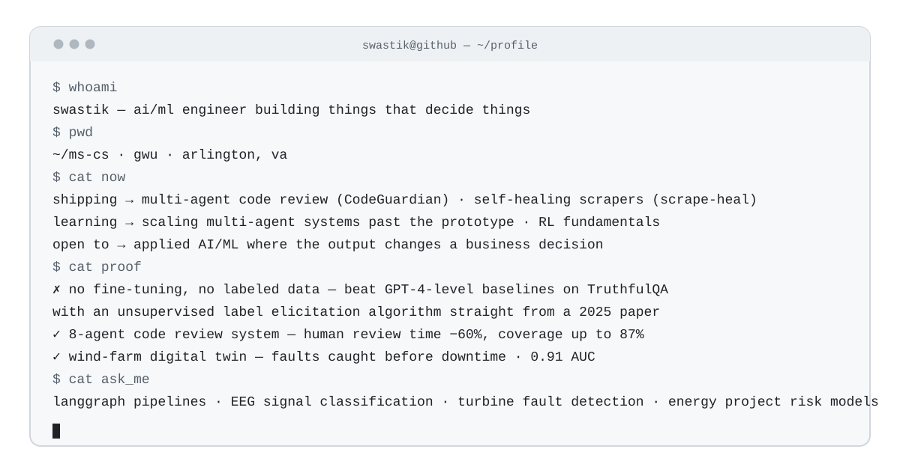

**AI/ML engineer** building agents that make decisions — and systems that survive contact with reality.

---

## What I've built

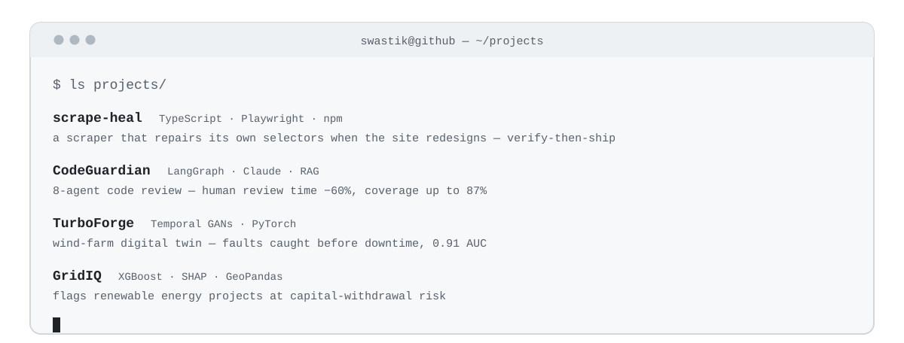

**Repos** — [scrape-heal](https://github.com/Swastikbhat-lab/scrape-heal) · [CodeGuardian](https://github.com/Swastikbhat-lab/CodeGuardian) · [TurboForge](https://github.com/Swastikbhat-lab/TurboForge) · GridIQ

## Tech stack

**Languages** — 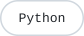 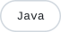 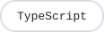 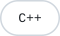

**AI / ML** — 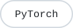      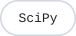

**Agents & Data** — 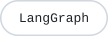 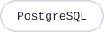  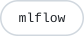

## GitHub stats

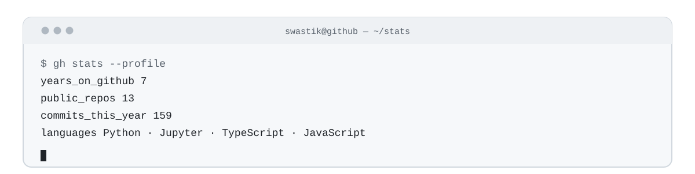

---

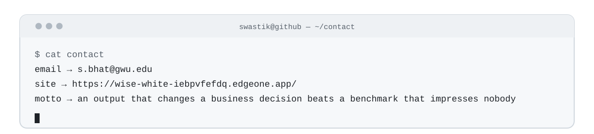

