<div align="center">



**AI/ML engineer** building agents that make decisions — and systems that survive contact with reality.

[](mailto:s.bhat@gwu.edu)
[](https://wise-white-iebpvfefdq.edgeone.app/)
[](https://github.com/Swastikbhat-lab)


</div>

---

```
$ whoami
swastik — ai/ml engineer building things that decide things
$ pwd
~/ms-cs · gwu · arlington, va
$ cat now
shipping  → multi-agent code review (CodeGuardian) · self-healing scrapers (scrape-heal)
learning  → scaling multi-agent systems past the prototype · RL fundamentals
open to   → applied AI/ML where the output changes a business decision
$ cat proof
✗ no fine-tuning, no labeled data — beat GPT-4-level baselines on TruthfulQA
  with an unsupervised label elicitation algorithm straight from a 2025 paper
✓ 8-agent code review system — human review time −60%, coverage up to 87%
✓ wind-farm digital twin — faults caught before downtime · 0.91 AUC
$ cat ask_me
langgraph pipelines · EEG signal classification · turbine fault detection · energy project risk models
```

---

## 📦 What I've built

| Project | What it does | Stack |
|:---|:---|:---|
| [**scrape-heal**](https://github.com/Swastikbhat-lab/scrape-heal) | A scraper that repairs its own selectors when the site redesigns — verify-then-ship, watchdog, selector ledger | TypeScript · Playwright |
| [**CodeGuardian**](https://github.com/Swastikbhat-lab/CodeGuardian) | 8-agent code review system. Cut human review time 60%, raised test coverage to 87% | LangGraph · Claude · Langfuse · RAG |
| [**TurboForge**](https://github.com/Swastikbhat-lab/TurboForge) | Wind farm digital twin. Detects faults before downtime — 0.91 AUC | Temporal GANs · Transformers · PyTorch |
| **GridIQ** | Flags renewable energy projects at capital-withdrawal risk before the money goes in | XGBoost · SHAP · GeoPandas · MISO/PJM |

## 🧰 Tech stack

**Languages** —    

**AI / ML** —       

**Agents & Data** —    

## 📈 GitHub stats

<div align="center">


</div>

---

<div align="center">

```
$ cat contact
email → s.bhat@gwu.edu
site  → https://wise-white-iebpvfefdq.edgeone.app/
motto → an output that changes a business decision beats a benchmark that impresses nobody
```

</div>
