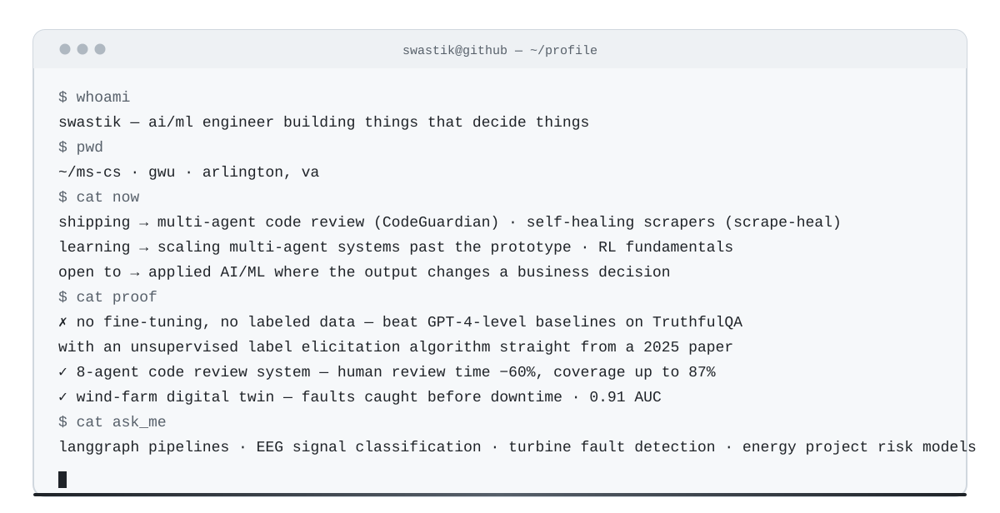
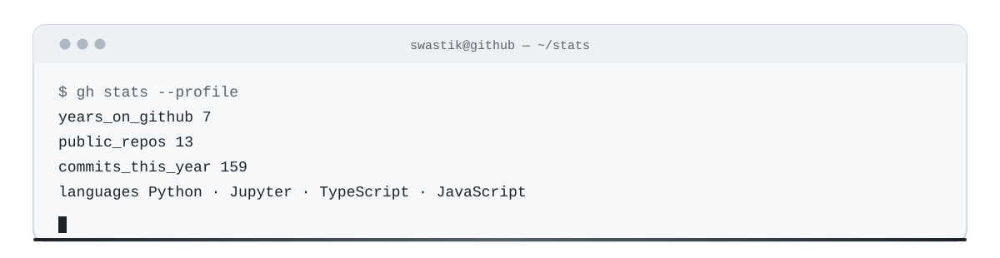
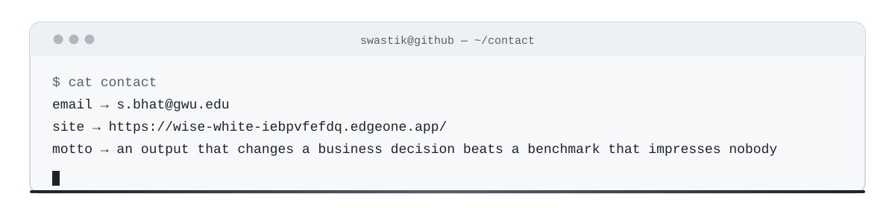

**AI/ML engineer** building agents that make decisions — and systems that survive contact with reality.

---

## What I've built

<table style="width:100%; border-collapse:separate; border-spacing:0 12px; border:0;">
<tr>
  <td style="background:#ffffff; border:1px solid #d0d7de; border-radius:12px; padding:16px 20px; box-shadow:0 4px 18px rgba(31,35,40,.06);">
    <a href="https://github.com/Swastikbhat-lab/scrape-heal" style="color:#1f2328; font-weight:700; text-decoration:none; font-size:16px;">scrape-heal</a>
    &nbsp;&nbsp;TypeScript · Playwright · <a href="https://www.npmjs.com/package/scrape-heal" style="color:#57606a;">on npm</a> 
    A scraper that repairs its own selectors when the site redesigns — verify-then-ship, watchdog, selector ledger, and LLM repair when even the data changes.
  </td>
</tr>
<tr>
  <td style="background:#ffffff; border:1px solid #d0d7de; border-radius:12px; padding:16px 20px; box-shadow:0 4px 18px rgba(31,35,40,.06);">
    <a href="https://github.com/Swastikbhat-lab/CodeGuardian" style="color:#1f2328; font-weight:700; text-decoration:none; font-size:16px;">CodeGuardian</a>
    &nbsp;&nbsp;LangGraph · Claude · Langfuse · RAG 
    8-agent code review system. Cut human review time 60%, raised test coverage to 87%.
  </td>
</tr>
<tr>
  <td style="background:#ffffff; border:1px solid #d0d7de; border-radius:12px; padding:16px 20px; box-shadow:0 4px 18px rgba(31,35,40,.06);">
    <a href="https://github.com/Swastikbhat-lab/TurboForge" style="color:#1f2328; font-weight:700; text-decoration:none; font-size:16px;">TurboForge</a>
    &nbsp;&nbsp;Temporal GANs · Transformers · PyTorch 
    Wind farm digital twin. Detects faults before downtime — 0.91 AUC.
  </td>
</tr>
<tr>
  <td style="background:#ffffff; border:1px solid #d0d7de; border-radius:12px; padding:16px 20px; box-shadow:0 4px 18px rgba(31,35,40,.06);">
    GridIQ
    &nbsp;&nbsp;XGBoost · SHAP · GeoPandas · MISO/PJM 
    Flags renewable energy projects at capital-withdrawal risk before the money goes in.
  </td>
</tr>
</table>

## Tech stack

**Languages** —    

**AI / ML** —       

**Agents & Data** —    

## GitHub stats

---

