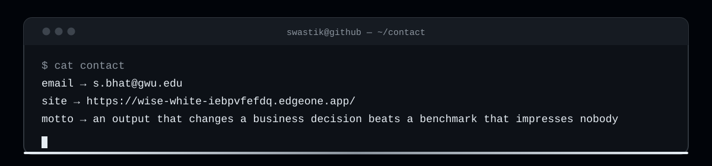

**AI/ML engineer** building agents that make decisions — and systems that survive contact with reality.

---

## What I've built

| Project | What it does | Stack |
|:---|:---|:---|
| [**scrape-heal**](https://github.com/Swastikbhat-lab/scrape-heal) | A scraper that repairs its own selectors when the site redesigns — verify-then-ship, watchdog, selector ledger | TypeScript · Playwright |
| [**CodeGuardian**](https://github.com/Swastikbhat-lab/CodeGuardian) | 8-agent code review system. Cut human review time 60%, raised test coverage to 87% | LangGraph · Claude · Langfuse · RAG |
| [**TurboForge**](https://github.com/Swastikbhat-lab/TurboForge) | Wind farm digital twin. Detects faults before downtime — 0.91 AUC | Temporal GANs · Transformers · PyTorch |
| **GridIQ** | Flags renewable energy projects at capital-withdrawal risk before the money goes in | XGBoost · SHAP · GeoPandas · MISO/PJM |

## Tech stack

**Languages** —    

**AI / ML** —       

**Agents & Data** —    

## GitHub stats

---

